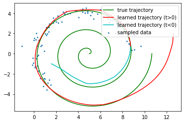
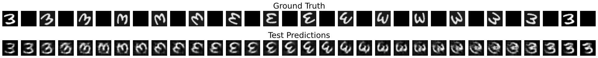

# VAE with continuous latent ODE dynamics

### Papers based on
[1] [T. Q. Chen, Y. Rubanova, J. Bettencourt, and D. K. Duvenaud. Neural ordinary differential equations. In _Advances in neural information processing systems_, pages 6571–6583, 2018.](https://papers.nips.cc/paper/2018/hash/69386f6bb1dfed68692a24c8686939b9-Abstract.html)

[2] [Ç. Yıldız, M. Heinonen, and H. Lähdesmäki. Ode2vae: Deep generative second order odes with bayesian neural networks. In _Advances in neural information processing systems_, pages 13412–13421, 2019.](https://papers.nips.cc/paper/2019/hash/99a401435dcb65c4008d3ad22c8cdad0-Abstract.html)

### Proposal
[Link to proposal](https://github.com/yufung/hse-ml-project/blob/main/docs/HSE-ML-Project-Proposal.pdf)

All four proposals were on static data such as single images, which did not match the general theme of the project on modelling raw data with time-dependence structure. The final research direction was modified from Proposal 2 and my new focus will be on comparing time dynamic modelling between neural first order and second order ordinary differential equations.

### Project goals

* Neural ODEs -> implement generative latent model on toy dataset
* ODE2VAE -> implement generative model on toy dataset
* Compare predictive performance of latent ODE model and ODE2VAE on an irregularly-sampled time series dataset

## Reproducing experiments

* The code is developed and tested on `Python 3.8`. Full list of dependencies:
```
matplotlib==3.4.2
numpy==1.19.5
torch==1.8.1
torchdiffeq==0.2.1
```

* To run experiments on rotating MNIST, you will need to download the data from [here](https://1drv.ms/u/s!AoCg_EHL_pqdhvJXVYVDdL2ww4ibOA).

#### 2D Spiral

<p align="center">

</p>


#### 3D Spiral

<p align="center">

</p>

#### Rotating MNIST

<p align="center">

</p>
